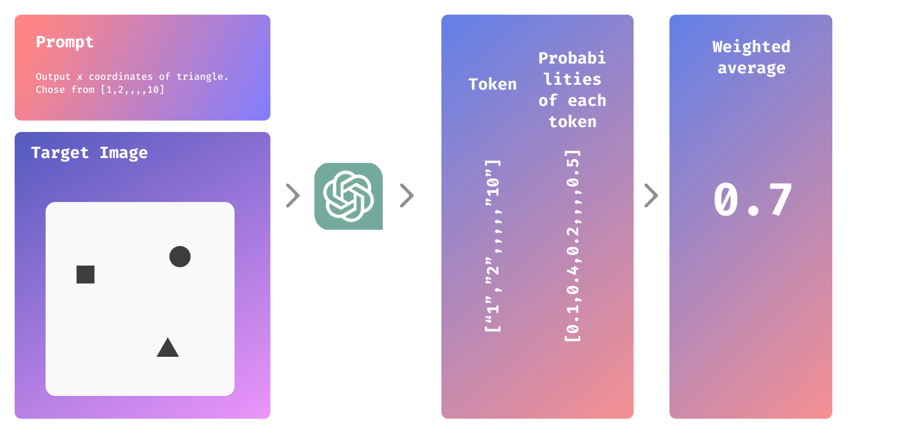

<h1 align="center">🎯 FeatureLLM 🎯</h1>

<h5 align="center">Project Page: https://shure-dev.github.io/featurellm/</h5>

  <!--  -->
  
<!--  -->

  <em>Boost prediction accuracy using token probablity</em>
  

<h2>🔍 Overview</h2>

  <strong>Weighted Token Sampler</strong> is a simple tool that improves prediction accuracy by calculating the weighted average of token probabilities. It's designed for tasks where precise predictions are needed within a defined range.

<h2>💻 Installation</h2>

Install the package with:

<pre><code>pip install git+https://github.com/your_username/featurellm.git</code></pre>

<h2>🚀 Quick Start</h2>
<pre><code>pip install git+https://github.com/your_username/featurellm.git</code></pre>

<h2>🏁 Conclusion</h2>

  <strong>Weighted Token Sampler</strong> is a straightforward tool to enhance prediction accuracy. Try it out in your projects to see the benefits!

